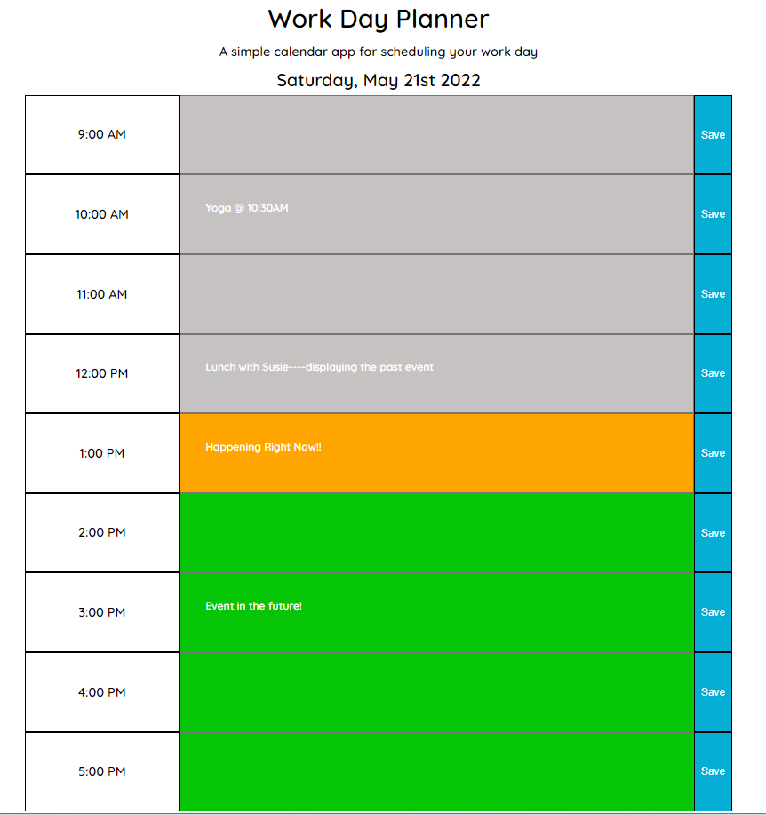

# Day Planner

This web application's purpose is to generate a workday calendar that enables the user to keep up with their busy day.

## How it Works

This application lets the user add/save tasks into each hour of the workday. It also displays the time of day with a color assignment. With gray being the past, orange being the present hour, and green featuring the hours you have left in that day.

## Applications Used:

* **HTML/CSS/JavaScript**: the structure is built within the HTML using divs/buttons and assigning each element with different attributes to style and manipulate the DOM in JS.

* **Moment.js**: implemented the moment.js CDNJS to display the current date at the top of the calendar, and also declared a variable using moment().hour() to assign a color to the time of day. For the color-coding functionality, I built a for loop using with a variable that contains each individual hour(row) to equal the current time. If that hour/row index = current time it would display the orange color, and so on.

* **jQuery**: implemented the jQuery api to make HTML Document Manipulation, Event Handling and declaring variables more efficient while building the application. Another time saver that jQuery gave me the ability to was to build the local storage feature. Instead of having 100+ lines of code, I was able to assign (object: key, values) in a much more efficent way.

* **Google Fonts**: I applied a universal google font 'Quicksand' to my HTML & CSS to give my calendar a more unique style.

## Mock Up

The following screenshot shows the web application's appearance:

To view this web application, [click here](https://lindsey-lansford.github.io/day-planner/).

## Questions

Please reach out with any questions you may have about this application.

* :octocat: GitHub: [@lindsey-lansford](https://github.com/lindsey-lansford)
* :envelope: Email: [lindsey.lansford@gmail.com](mailto:lindsey.lansford@gmail.com)